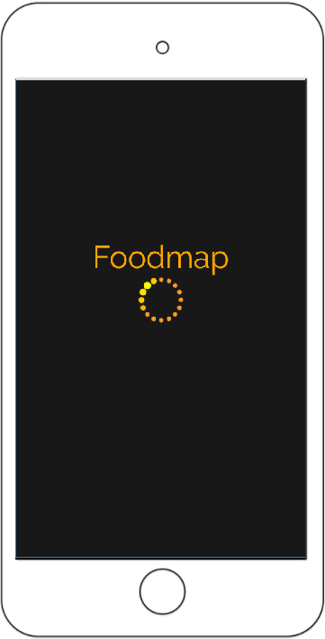
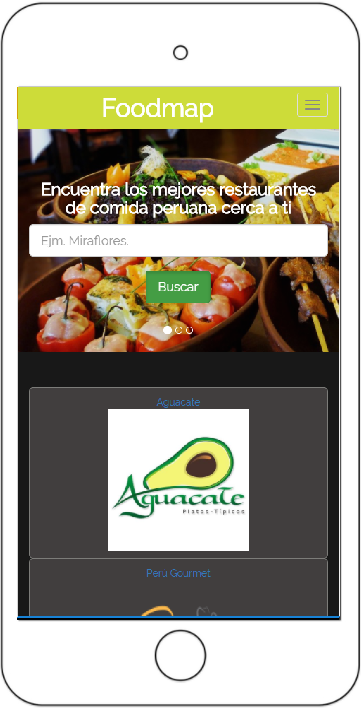

# RETO 1: Foodmap

* **Curso:** _Responsive web Design_
* **Unidad 3:** _Agiliza tu desarrollo_
* **Tema** _Reto N° 1 -USO DE JQUERY 

***
## OBJETIVO
* Recrear una web-app que a través de un input pueda filtrar los restaurantes que se encuentren cerca de ti. 

## Flujo de trabajo
* Creamos la página utilizando Bootstrap para hacer responsive junto al diseño css. 

* **Vista splash** con duración de 2 a 5 segundos que redirecciona a tu vista principal.

* En la vista principal se muestran todos los **restaurantes "cerca de ti"** junto con el input para filtrar tu elección.

* Agrega un evento **mouseover** a las imágenes (Cambio de tamaño, muestra de texto, cambio de imagen, información, etc). 

* Al seleccionar alguno de los restaurantes, deberá mostrarse la información de este a través de **un modal**. 

* Una vez cerrado el modal debe **volver a la vista principal**. 

 
## Herramientas utilizadas

* HTML 5
* CSS 3
* Bootstrap
* JQuery

## PRODUCTO FINAL

#### VERSIÓN MOVIL

#### MODALES

* Inicia Sesión

* Filtrar restaurante

* Efecto mouseover

* Información mediante un modal
